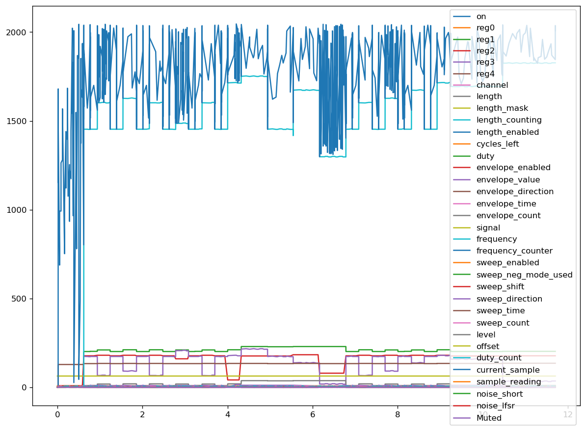

# GBMDB
## The Game Boy Music Database

This is a project based on the [NES Music Database](https://github.com/chrisdonahue/nesmdb) which attempts to follow a similar methodology for Game Boy games.

It is a work in progress, if you have any comments or suggestions please let me know!

Here is an example of some expressive characteristics that have been extracted from the Pokemon theme song:

## To-do list:

- Create MIDI data from expressive characteristics
  - This will require investigating how to calculate "note-on" and "note-off" messages
- Sort through which expressive characteristics are most useful in a musical context
- Optimize file size of captured data
- Add checksums for verified data dumps